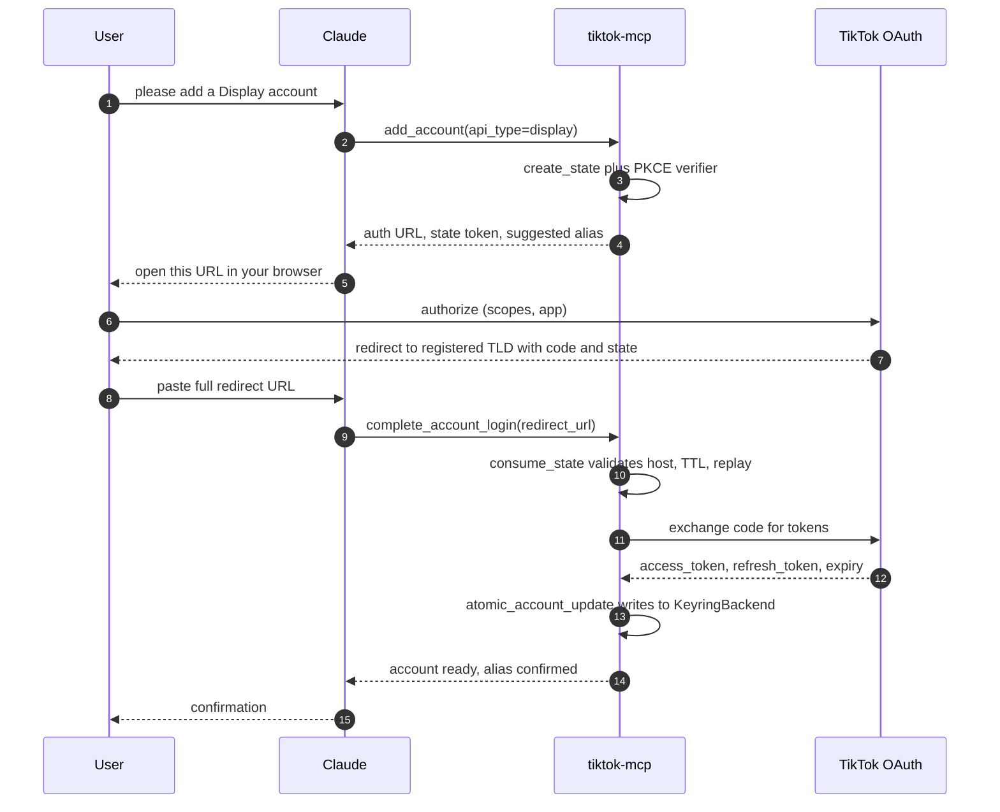
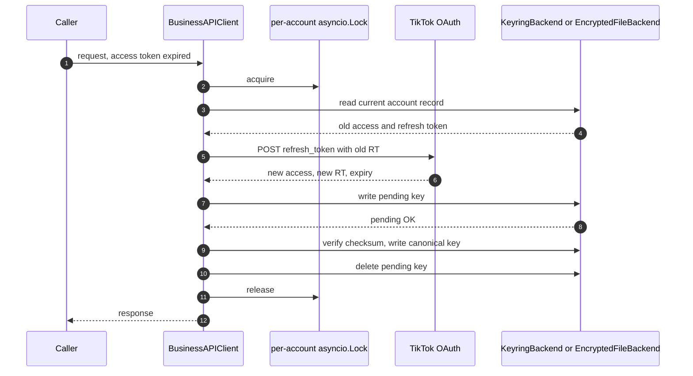
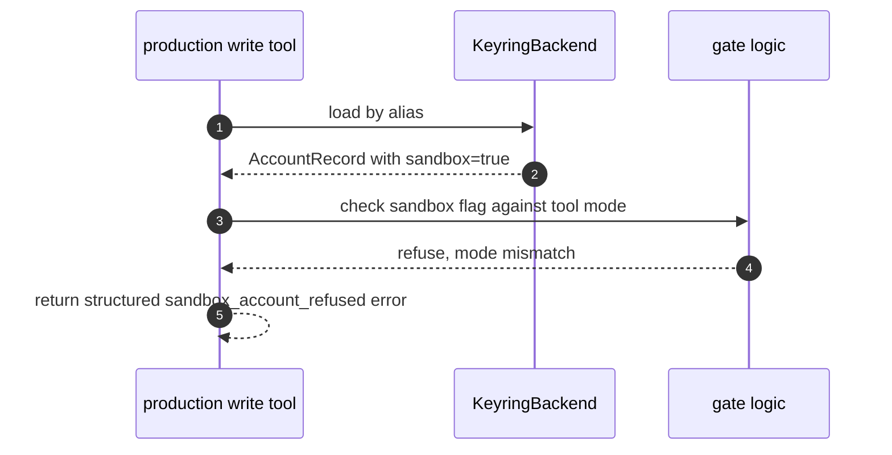

# Auth Architecture

This doc describes how `tiktok-mcp` handles authentication and token storage
for the four supported TikTok APIs. It covers the multi-account model, the
manual-paste OAuth flow, the in-memory OAuth state manager, the per-API token
refresh strategy, atomic refresh-token rotation, the concurrency model,
sandbox isolation, and recovery paths. Symbol references point at the actual
code in this repository so the docs stay honest as the implementation
evolves.

## 1. Multi-account model

An "account" is the tuple `(api_type, alias, sandbox)`. Each tuple maps to
exactly one TikTok-side identity and one set of tokens. A single user can
hold a Display account, a Marketing account, a Business Organic account, and
a Content Posting account, each with its own alias. Any of those can also
exist in sandbox mode under the same alias because sandbox lives in a
separate keychain namespace (see section 7).

The canonical storage key shape is built by `account_key` in
`src/tiktok_mcp/auth/keychain.py`:

`tiktok-mcp::<api>::<sandbox|production>::account::<alias>`

`add_account` returns a suggested alias of the form `<country>-<type>-<short_id>`,
`complete_account_login` accepts `alias_override`, and `rename_account`
changes the suffix later. Duplicate aliases are rejected with a
`-1`, `-2` suggestion at onboarding time. The tool surface lives in
`src/tiktok_mcp/tools/accounts.py`.

## 2. Manual-paste OAuth flow

TikTok developer consoles don't accept loopback or IP redirect URIs. They
require a registered TLD. The MCP therefore never opens an HTTP listener and
never runs a hosted relay. Instead the user pastes the final redirect URL
back into Claude.

The two entry points are `add_account` and `complete_account_login` in
`src/tiktok_mcp/tools/accounts.py`. Both sit behind
`TIKTOK_MCP_ALLOW_ACCOUNT_CHANGES`, not behind `TIKTOK_MCP_ALLOW_WRITES`,
because adding an account doesn't mutate TikTok-side state and the user
permission profile is different.

## 3. State manager design

OAuth `state` values and PKCE verifiers live in process memory. The full
implementation is `src/tiktok_mcp/auth/state.py`. Three invariants hold:

1. TTL is 10 minutes from issue. Stored as `expires_at` on the
   `OAuthInProgress` record.
2. Single use. `consume_state` pops the entry, then records the state in a
   bounded `_RECENTLY_CONSUMED` map so a replay raises
   `OAuthStateInvalidError` with `reason="replay"`.
3. Concurrency safety. Every mutation goes through a module-level
   `asyncio.Lock`. Two parallel `complete_account_login` calls with the same
   state token cannot both succeed.

A restart loses all in-flight states. The MCP tells the user to invoke
`add_account` again rather than trying to recover a half-finished flow.

## 4. Token storage backends

Tokens never live on disk in plaintext. The selection logic sits in
`get_backend` in `src/tiktok_mcp/auth/keychain.py`:

1. Try `KeyringBackend`, which wraps `keyring.set_password`,
   `keyring.get_password`, and `keyring.delete_password`. macOS Keychain,
   Windows Credential Manager, and Linux Secret Service all go through
   this path.
2. On `keyring.errors.NoKeyringError`, fall back to `EncryptedFileBackend`.
   That backend stores an AES-Fernet encrypted JSON blob under
   `platformdirs.user_data_dir("tiktok-mcp")`. The Fernet key itself stays
   in the keychain when one exists, and on disk only when there's no
   working keychain at all.

Both backends share the same record schema (`AccountRecord` with `account`
and `tokens` fields) and the same `serialize_account_record` and
`deserialize_account_record` helpers, so swapping backends doesn't change
what callers see.

## 5. Token refresh strategy per API

Each API client owns its own refresh path and checks expiry on every call.
The refresh skew window is 5 minutes: if the stored
`access_token_expires_at` falls within that window, the client refreshes
proactively before issuing the actual request.

| API              | Header                  | RT rotates? | Client class       |
|------------------|-------------------------|-------------|--------------------|
| Display          | `Authorization: Bearer` | yes         | `DisplayAPIClient` |
| Marketing        | `Access-Token`          | sometimes   | `BusinessAPIClient`|
| Business Organic | `Access-Token`          | sometimes   | `BusinessAPIClient`|
| Content Posting  | `Authorization: Bearer` | yes         | shares Display refresh shape |

Two header-shape gotchas worth calling out, because they trip people up:

- Display uses `Authorization: Bearer <access_token>`. See
  `DisplayAPIClient.request` in `src/tiktok_mcp/api/display/client.py`.
- Marketing and Business Organic use `Access-Token: <access_token>` with no
  `Bearer` prefix. See `BusinessAPIClient.request` in
  `src/tiktok_mcp/api/business/client.py`. The source comment flags this
  explicitly.

## 6. Atomic refresh-token rotation

The unsafe pattern would be: read the old RT, discard it, POST to the
refresh endpoint, write the new RT. A crash, a locked keychain, or a
network blip between the POST and the write loses the new RT and leaves the
account in a broken state. The MCP avoids that with `atomic_account_update`
in `src/tiktok_mcp/auth/keychain.py`.

The store always sees the new token under the pending suffix before the
canonical key is overwritten, and the checksum verification rejects a
corrupted intermediate read. A crash after the pending write leaves the
canonical record intact, so the next call retries the refresh cleanly
rather than locking the account out.

## 7. Per-account concurrency

Every account has its own `asyncio.Lock`. The Display client uses a
module-level `_REFRESH_LOCKS` map keyed by `(api_type, sandbox, alias)`;
the Business client mirrors that with its own map plus a guard lock around
the map itself. Parallel reads on one account share the live access token.
Parallel writes on one account aren't serialized at the API call layer (the
server arbitrates ordering), but they share one refresh lock so only one
refresh ever lands per account. Calls across distinct accounts run fully
in parallel.

## 8. Sandbox isolation

Sandbox accounts use a distinct keychain prefix: production keys carry
`::production::` and sandbox keys carry `::sandbox::`. The `sandbox` flag
also lives on the `Account` record itself, so a tool that loads an account
by alias still sees the boolean and can refuse the call when the caller is
in the wrong mode. Production write tools reject sandbox accounts before
any HTTP request leaves the process.

`add_account` and `complete_account_login` both take an explicit mode flag
when the user wants sandbox; there is no silent fallback from production
to sandbox or vice versa.

## 9. Recovery paths

- Locked keychain at startup. `get_backend` catches the locked-keychain
  error on its probe and falls through to `EncryptedFileBackend`. The user
  keeps working, and the Fernet key is read from disk when the keychain
  refuses to release it.
- Expired OAuth state token. `consume_state` raises
  `OAuthStateInvalidError` with `reason="expired"`. The user re-invokes
  `add_account`; the previous attempt is already cleared from `_STATES`.
- Replayed OAuth state token. Same exception class with `reason="replay"`.
  The paste is rejected and no token exchange runs.
- Expired refresh token. TikTok returns its auth error code on the refresh
  endpoint. The client marks the account `BROKEN` via
  `atomic_account_update` on the status field and raises
  `AccountBrokenError`. The user re-onboards with `add_account`.
- Second 401 after a refresh attempt. Same outcome: account flips to
  `BROKEN`, `AccountBrokenError` propagates. One refresh attempt per
  failing call, never an infinite loop.
- Partial keychain write. The pending key stays behind under
  `::__pending__`. The next refresh on the same account overwrites it, and
  the canonical record is unchanged in the meantime so reads still work.

## 10. What this design explicitly does NOT do

No loopback HTTP listener. No hosted relay. No browser callback that the
MCP itself answers. No plaintext token file. No per-account daemon. No
background refresh thread. The MCP refreshes only when a request needs a
token, and only while the caller is awaiting that request. Anything that
would require infrastructure or a long-lived listener is out of scope for
v0.1 by design, not by oversight.
